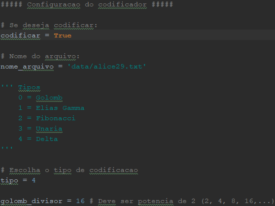

# Trabalho de Teoria da Informação Grau A - T1

Esse projeto foi desenvolvido para atender a entrega do trabalho 1 de Teoria da Informação do grau A na Unisinos. Tem como objetivo codificar e decodificar arquivos utilizando Golomb, Elias-Gamma, Fibonacci, Unaria ou Delta.

Link para segunda parte do trabalho sobre tratamento de ruído -> https://github.com/daniellferreira/noise-handler

## Instalação

### Pré-requisitos

Não foi utilizado nenhuma biblioteca ou serviços de terceiros, apenas o já vem disponível dentro da instalação do Python 3.x, que no caso foi a biblioteca:
* math

### Como Instalar

A instalação pode ser feita baixando manualmente do GitHub ou rodando o seguinte comando na ferramente Git:

```
git clone https://github.com/vmatter/Codificador_Decodificador.git
```

## Como Usar

Para facilitar o uso, foi criado o arquivo "main.py", nele é possível informar o arquivo e o método que deseja codificar e/ou decodificar.

### Codificador

Para codificar é necessário setar a variável "codificar" para "True", informar o nome do arquivo com sua extensão, o tipo e caso tenha selecionado o tipo Golomb informar o divisor, caso contrário pode deixar qualquer valor. Segue imagem de demosntração da configuração:



### Decodificador

Para codificar é necessário setar a variável "decodificar" para "True", informar o nome do arquivo com sua extensão e a extensão que deseja que o arquivo já decodificado tenha. Segue imagem de demosntração da configuração:
OBS: Caso a extensão não tenha sido alterada após a codificação, ela será o nome do codificador usado, porem não é obrigatório para realizar a decodificação, ou seja, após a codificação pode ser alterado a extensão do arquivo para por exemplo .txt e mesmo assim o decodificador irá realizar a decodificação sem problemas.


## Limitações

### Golomb

Para codificar utilizando o método Golomb, só é possível utilizando um divisor que seja potência de 2, ou seja, 2, 4, 8, 16,...